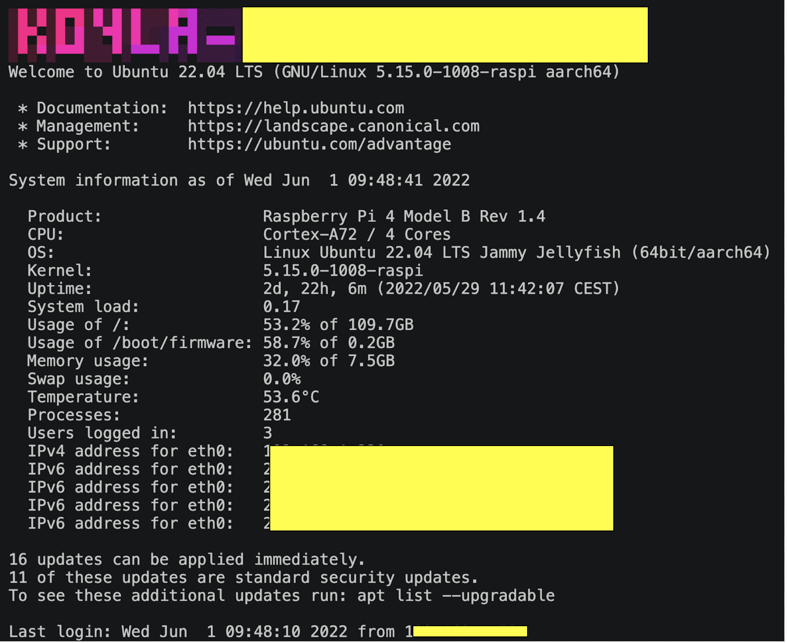

# ubuntu-motd-sysinfo
[](https://forthebadge.com)

## Why

The MOTD (Message of the Day) on a Linux system is a feature that displays
a message or information to users when they log into the system. The purpose
of the MOTD can vary, but it is commonly used to convey important information
to users such as system updates, news, or status information.

Ubuntu server use the landscape-sysinfo and we want more details and more fun.

## Result


## How to deploy
```
git clone https://github.com/francois-le-ko4la/ubuntu-motd-sysinfo.git
cd ubuntu-motd-sysinfo/
sudo apt install figlet toilet toilet-fonts lolcat
sudo pip3 install -r requirements.txt
sudo cp 00-fprint-hostname 40-ubuntu-motd-sysinfo /etc/update-motd.d/
cd /etc/update-motd.d/
sudo chmod +x 00-fprint-hostname 40-ubuntu-motd-sysinfo
sudo chmod -x 50-landscape-sysinfo
```
